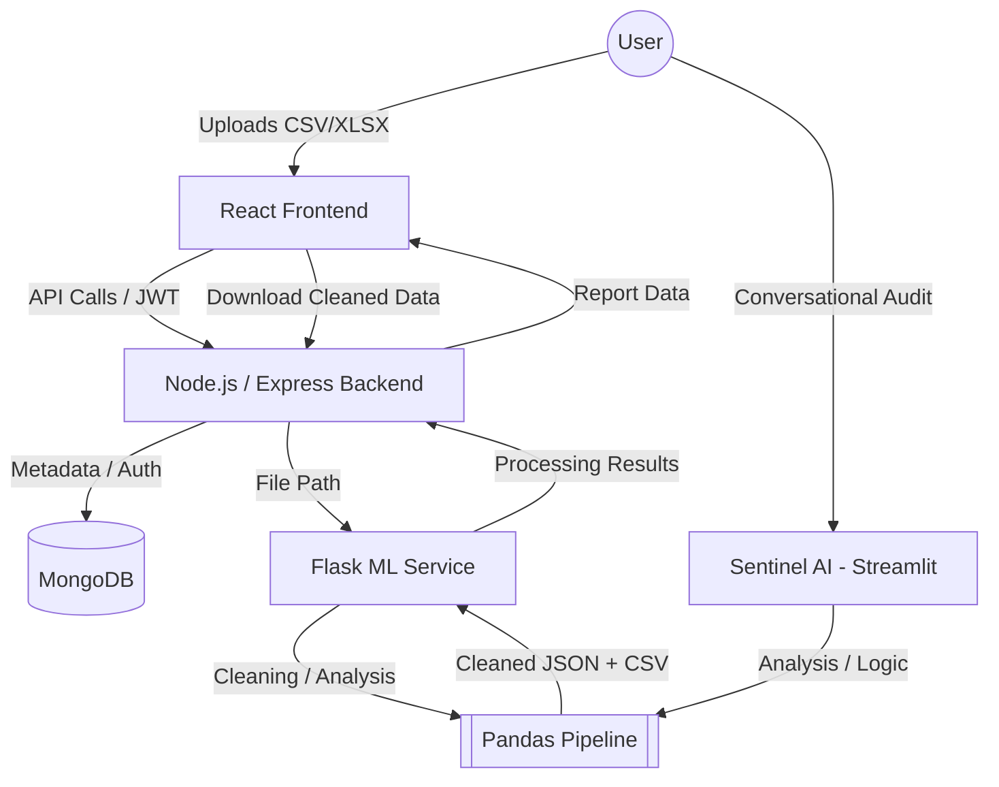

# Quality Guardian 🛡️

Quality Guardian is a comprehensive data quality management platform designed for B2B lead generation and CRM data cleaning. It combines a modern MERN stack frontend with a powerful Python-based ML microservice to identify, analyze, and remediate data inconsistencies in real-time.

## 🏗️ System Architecture



## 📁 Project Structure

- **`client/`**: React + Vite + Tailwind CSS dashboard. Features high-performance visualizations and real-time report auditing.
- **`server/`**: Node.js + Express backend. Handles authentication, file management, and orchestration between the UI and ML service.
- **`ml/`**: Python + Flask microservice. The core logic engine that performs data validation, normalization, and imputation. Also hosts **Sentinel AI** (Streamlit Chat Assistant).

## 🚀 Getting Started

### Prerequisites
- Node.js (v16+)
- Python (3.9+)
- MongoDB (Running locally or via Atlas)

### Installation & Running

1. **Start the ML & Chatbot Services**:
   ```bash
   cd ml
   pip install -r requirements.txt
   python app.py                 # Backend API (Port 5000)
   streamlit run streamlit_chatbot.py  # AI Assistant (Port 8501)
   ```

2. **Start the Express Server**:
   ```bash
   cd server
   npm install
   npm run dev                   # Backend API (Port 5000/5174 depending on config)
   ```

3. **Start the Frontend Dashboard**:
   ```bash
   cd client
   npm install
   npm run dev                   # Frontend (Port 5173)
   ```

---

*Refer to individual component READMEs for deep-dive logic and implementation details.*
